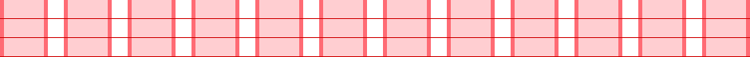

# Gridlines

Gridlines is a Sass mixin that generates image-less grid backgrounds with ease. This eliminates having to create and recreate a bitmap image every time you want to experiment with a new set of measurements or viewport dimensions.



## Installation

Install with Bower (`bower install sass-gridlines`) or manually download the [_gridlines.scss](_gridlines.scss) file to your project’s directory.

## Usage

1. Import the Sass partial.

2. Configure the mixin.

  ```scss
  body {
    @include gridlines(60px, 20px, 5px, 24px);
  }
  ```

3. Save countless hours!

### Arguments

The `gridlines` mixin takes four arguments. They are all optional—although, either `$width-column` or `$line-height` must be present—and in order, they are:

1. `$width-column`
2. `$width-gutter`
3. `$width-padding`
4. `$line-height`

### Variables

1. `$gl-vendor-prefix`: Sets the vendor prefix on linear-gradients. By default, this is "webkit".
